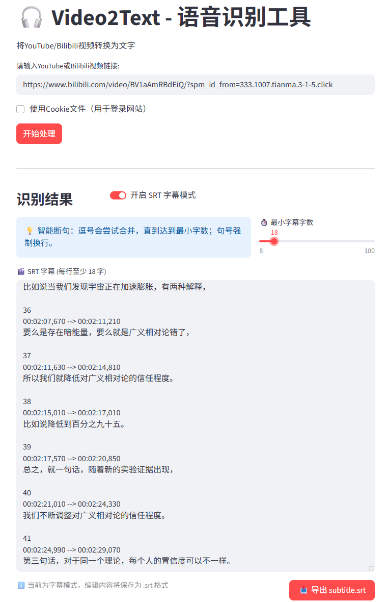
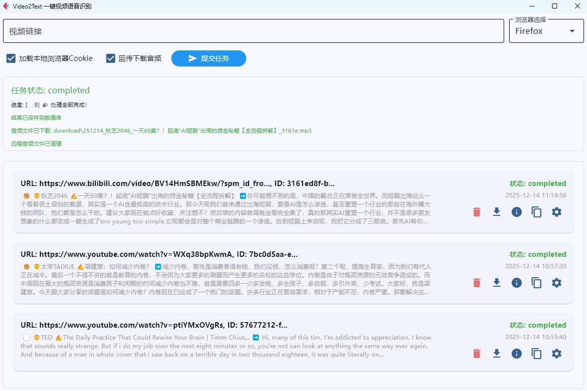

# Video2Text
一键视频语音识别与字幕转换，本地部署模型版本、基于funasr、pytorch、yt-dlp、streamlit、ffmpeg

## 功能特性

- 支持YouTube和Bilibili视频
- 自动下载音频并转换为文字
- 智能断句生成SRT字幕文件
- 支持CUDA加速（如果可用）
- 支持使用Cookie文件访问需要登录的视频内容

## 使用方式

### 安装依赖
```
// 安装 FFMpeg
// Ubuntu
sudo apt install ffmpeg
// MacOS
/bin/bash -c "$(curl -fsSL https://raw.githubusercontent.com/Homebrew/install/HEAD/install.sh)"
brew install ffmpeg
// Windows（运行命令后重启窗口）
winget install Gyan.FFmpeg

pip install -r requirements.txt
```

### 集成GUI Client模式
```
streamlit run converter_app.py --server.port=8351
```
浏览器直接访问`http://127.0.0.1:8351/`即可使用



### 远程API Server模式
```
python converter_app_remote.py
```

详细API文档请参见 [README_REMOTE.md](README_REMOTE.md)

需要搭配功能更完备的独立前端GUI Client程序使用（详见 https://github.com/tk166/Video2TextGUI ）




## Cookie 文件支持

本工具的两种工作模式均支持使用cookie文件来访问需要登录的视频内容。在图形界面中，您可以勾选"使用Cookie文件"选项并上传cookie文件。

Cookie文件需要是Netscape格式。更多信息请参见 [COOKIE_FORMAT.md](COOKIE_FORMAT.md)

## 依赖说明

- streamlit: 图形界面
- flask: 远程API服务
- yt-dlp: 视频下载
- ffmpeg-python: 音频处理
- librosa: 音频分析
- torch/torchaudio: 音频处理
- funasr: 语音识别
- modelscope: 模型管理
- watchdog: 文件监控

使用gemini-3-pro-preview与qwen3-coder-plus生成代码

MIT协议
